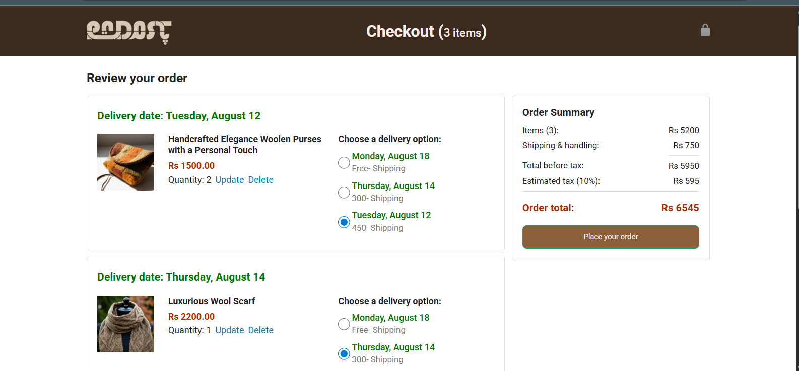

# Padast – Wool Clothing Store Website

Padast is a fully functional e-commerce web application for a wool-based clothing brand.  
It features product listings, a shopping cart, checkout, order tracking, and a clean, responsive design.  
The name "Padast" comes from Pashto, meaning **"through fingers or hands"**, representing handmade and crafted products.

---

## 📂 Project Structure

PADAST/
│
├── backend/ # Server-side scripts, APIs, and order processing logic
├── data/ # Static data, product JSON files
├── images/ # Product and website images
├── screenshots/ # UI preview images for documentation
├── script/ # JavaScript files for frontend interactivity
├── styles/ # CSS files for styling
├── test-jasmine/ # Jasmine test cases for JavaScript functionality
│
├── checkout.html # Checkout page
├── orders.html # Orders management page
├── padast.html # Homepage
├── tracking.html # Order tracking page
└── README.md # Project documentation

yaml
Copy
Edit

---

## 🚀 Features

- **Modern UI Design** – Simple, clean, and responsive layout
- **Product Listing** – Display of available wool products
- **Shopping Cart** – Add/remove products and update quantities
- **Checkout System** – Simulated checkout flow
- **Order Tracking** – Track placed orders by ID
- **Responsive Design** – Works on mobile, tablet, and desktop
- **JavaScript Interactivity** – Dynamic updates without page reloads
- **Testing with Jasmine** – Ensures code reliability

---

## 🛠️ Technologies Used

**Frontend:**
- HTML5
- CSS3
- JavaScript (ES6)

**Backend:**
- Node.js (for API & order processing)
- JSON data handling

**Testing:**
- Jasmine (JavaScript testing framework)

---

## 📸 Screenshots

| Homepage | Checkout Page | Order Tracking |
|----------|---------------|----------------|
|  |  |  |

---

## 📦 Installation & Usage

### 1️⃣ Clone the repository
```bash
git clone https://github.com/your-username/Padast-Clothing-Store.git
2️⃣ Navigate into the project
bash
Copy
Edit
cd Padast-Clothing-Store
3️⃣ Open the website locally
Simply open padast.html in your browser
(or set up a local server for backend features)

Example using VS Code Live Server:

bash
Copy
Edit
# Install Live Server extension
# Right-click padast.html -> "Open with Live Server"
🧪 Running Tests
To run the Jasmine tests:

Open test-jasmine/ in a browser

View results in the Jasmine test runner

📄 License
This project is licensed under the MIT License – see the LICENSE file for details.

👨‍💻 Author
Adnan Khan

GitHub: your-username

Portfolio: your-portfolio-link